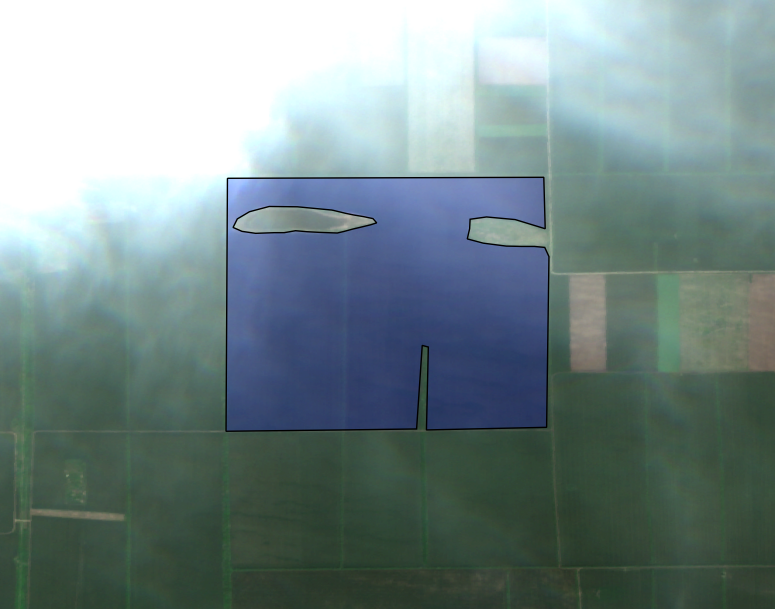
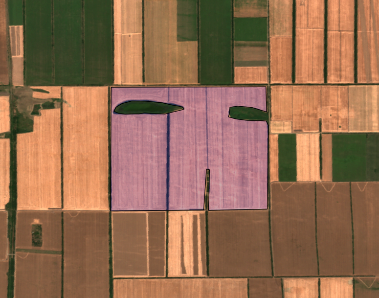

# Cloud task

This small script allows you to download images from the satellite using the sentinel-hub API.
It also implements the ability to evaluate cloudiness in the image and highlight the necessary fields, initially specified in the geojson format.

# Try it!
You need to register on the site https://www.sentinel-hub.com/ and get CLIENT_ID and CLIENT_SECRET.
To run the script you need the following environment variables.
```shell
# setenv.sh
export CLIENT_ID='id'
export CLIENT_SECRET='secret'
```
Then install requirements.
```shell
pip install requirements.txt
```

Select a field, for example using geojson.io. And downloda geojson file or use my ./data/polygon.json.
Then run example from main.py.

98% cloudy



0% cloudy

